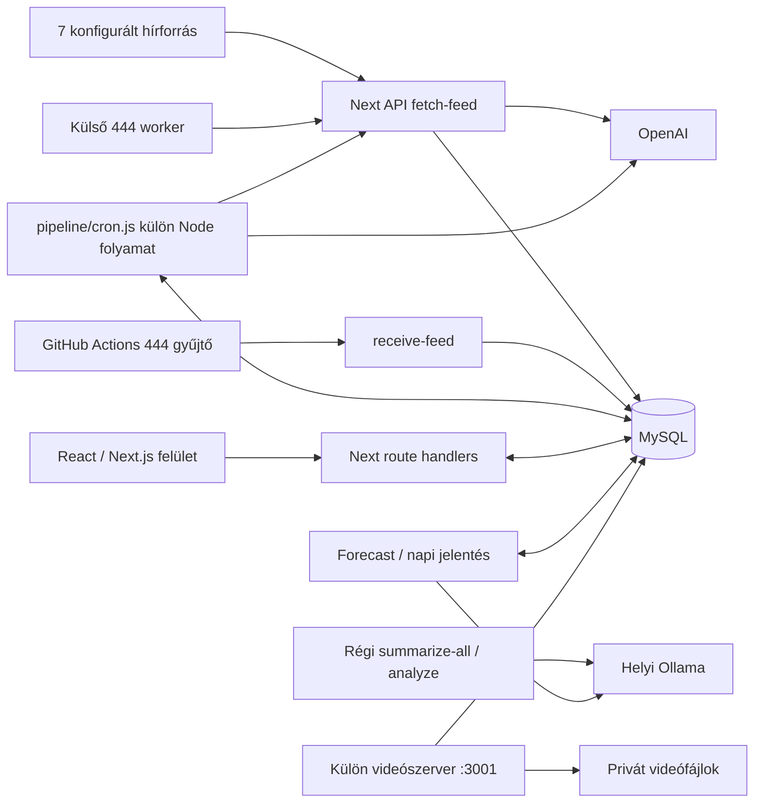

# Utom.hu – technikai audit

Audit dátuma: 2026. szeptember 24. Munkakönyvtár: `F:\Projekt2025\Lumen`. Vizsgált commit: `7df3f0792715f513f1293277b97095dcbbf89ce4` (2026-03-12). Az induló munkafa tiszta volt.

## 1. Vezetői megállapítás és bizonyítási határok

**Jelentős, újrafelhasználható prototípus áll rendelkezésre, de a jelenlegi állapot nem alkalmas nyilvános, fizetős újraindításra.** A hírgyűjtő, az AI-feldolgozás, a kereső, az elemző képernyők és a felhasználói folyamatok megvannak a kódban. A szerveroldali hitelesítés, a veszélyes végpontok védelme, az időadatok jelentése és a feldolgozás megbízhatósága azonban javítandó. A fizetés és az előfizetés életciklusa nincs megvalósítva.

A vizsgálat 293 követett fájl leltárára, 60 API-route feltérképezésére, a fő végrehajtási utak és SQL-műveletek olvasására, Git-metaadatokra, függőségvizsgálatra és izolált helyi próbákra épül. A leltár nem jelenti minden megjelenítési komponens teljes viselkedési tesztjét. A bináris videók tartalmát nem elemeztem.

Bizonyítékjelölések:

- **Kód:** a viselkedés a megadott fájlban/funkcióban közvetlenül látható.
- **Próba:** helyben lefuttatott, az alábbi ellenőrzési naplóban szereplő vizsgálat.
- **Következtetés:** a kódból következő kockázat, tényleges üzemi előfordulása nem mért.
- **Ismeretlen:** éles adat, konfiguráció, jog vagy üzemeltetési körülmény nem hozzáférhető.

Nem létesítettem adatbázis-kapcsolatot; nincs átadott sémaexport, adatmentés vagy éles üzemeltetési konfiguráció. A történeti adattartalom, a ténylegesen futó folyamatok, a külső worker működése, a források jelenlegi elérhetősége és az OpenAI-fiók jogosultságai ismeretlenek. Nem indult alkalmazásszerver, gyűjtés, AI-hívás, levélküldés vagy adatbázis-módosítás. A forráskód és a távoli repository változatlan maradt.

## 2. Architektúra és technológiák

Ez **kódból rekonstruált kapcsolati ábra**, nem igazolt telepítési topológia. A külön workerfolyamatok indítását nem tartalmazza a `package.json`.

| Terület | Követett verzió / megoldás | Bizonyíték, megjegyzés |
|---|---|---|
| Webalkalmazás | Next.js 16.1.1, React/React DOM 19.2.0 | [package-lock.json](F:/Projekt2025/Lumen/package-lock.json), App Router |
| Nyelvek | TypeScript, JavaScript; ESM és CommonJS vegyesen | [tsconfig.json](F:/Projekt2025/Lumen/tsconfig.json), `allowJs`, `strict`, `noEmit` |
| UI | Tailwind 4, Bootstrap 5, Zustand, SWR; Recharts, Chart.js, ApexCharts, Three.js | [package.json](F:/Projekt2025/Lumen/package.json); több párhuzamos vizualizációs könyvtár |
| Adatbázis | mysql2 3.15.3; közvetlen SQL | [lib/db.ts](F:/Projekt2025/Lumen/lib/db.ts), számos külön connection/pool |
| Hírkinyerés | rss-parser, Cheerio, JSDOM 27.4.0, Puppeteer 24.37.3 | [fetch-feed](F:/Projekt2025/Lumen/app/api/fetch-feed/route.ts), [cleanArticle](F:/Projekt2025/Lumen/pipeline/cleanArticle.js) |
| AI | OpenAI SDK 6.22.0 és közvetlen HTTP; Ollama HTTP | [aiClient](F:/Projekt2025/Lumen/pipeline/aiClient.js), [forecast](F:/Projekt2025/Lumen/forecast/forecast.js) |
| Felhasználók | bcryptjs, saját cookie-kezelés, Nodemailer | [login](F:/Projekt2025/Lumen/app/api/auth/login/route.ts), [mailer](F:/Projekt2025/Lumen/lib/mailer.ts) |
| Videó | Node HTTP szerver, HMAC URL, ffmpeg, helyi MP4 | [video-server](F:/Projekt2025/Lumen/video-server.js), [generate-thumbnail](F:/Projekt2025/Lumen/app/api/hirado/generate-thumbnail/route.ts) |
| Ellenőrzés | ESLint 9, eslint-config-next 16.0.7, TypeScript 5 | Nincs `test` script; a Next és az ESLint konfiguráció verziója eltér |

A lockfile szerint a Next Node >=20.9.0-t, a JSDOM `^20.19.0 || ^22.12.0 || >=24.0.0` verziót igényel. A helyi Node 24.19.0 és npm 11.17.0 rendelkezésre áll, de `node_modules` nincs. A MySQL 8 kompatibilitás különösen fontos: a [duplication route](F:/Projekt2025/Lumen/app/api/insights/duplication/route.ts:29) `utf8mb4_0900_ai_ci` kollációt használ. MariaDB-kompatibilitás nem állítható.

### Aktívnak szánt és régi kód elkülönítése

| Kódrész | Minősítés | Indok |
|---|---|---|
| `app/`, hivatkozott `components/`, `hooks/`, `store/` | Jelenlegi webes felület | Next útvonalak és importok; a tényleges telepítés nem ismert |
| [pipeline/cron.js](F:/Projekt2025/Lumen/pipeline/cron.js) | Jelenlegi OpenAI főfeldolgozónak szánt önálló belépési pont | GPT-4o mini, embedding, klaszter, clickbait, sentiment egy láncban |
| [lib/cron.ts](F:/Projekt2025/Lumen/lib/cron.ts), [serverInit](F:/Projekt2025/Lumen/lib/serverInit.ts) | Régi automatikus indítási kísérlet | Ötpercenként fetch-feed és summarize-all; a serverInit bekötése nem látható |
| [app/middleware.ts](F:/Projekt2025/Lumen/app/middleware.ts:2) | Hibás/eldolgozatlan indítási maradvány | `./lib/cron` nem létezik az `app` alatt; nem gyökérszintű middleware; engedélyező komment mellett 200-as saját Response |
| [lib/cron.js](F:/Projekt2025/Lumen/lib/cron.js) | Régi, ebben a struktúrában törött | Nyolc hiányzó relatív modulimport, hat Ollama-végpont |
| [summarize-all](F:/Projekt2025/Lumen/app/api/summarize-all/route.ts), [analyze](F:/Projekt2025/Lumen/app/api/analyze/route.ts) | Régi, de továbbra is regisztrált API-k | Ollama; attól, hogy régi, még HTTP-n elérhető lehet |
| [processArticle](F:/Projekt2025/Lumen/lib/processArticle.js), [extractKeywords](F:/Projekt2025/Lumen/pipeline/extractKeywords.js), [detectTrends](F:/Projekt2025/Lumen/pipeline/detectTrends.js), [clickbait](F:/Projekt2025/Lumen/pipeline/clickbait.js), [summarizeShortValidator](F:/Projekt2025/Lumen/pipeline/summarizeShortValidator.js) | Alternatív/régi segédmodulok | A fő OpenAI-lánc nem ezeket használja az adott lépésekhez |
| [forecast](F:/Projekt2025/Lumen/forecast/forecast.js), [autohirek](F:/Projekt2025/Lumen/autohirek/index.js) | Önálló kiegészítő folyamat | Ollama-függő; a napi jelentésben a TTS-hívás ki van kommentelve |
| [trend-cron](F:/Projekt2025/Lumen/lib/trend-cron.js) | Külön, potenciálisan ütköző aggregátor | Óránként és betöltéskor is ír a trends táblába |
| `scripts/`, `test-444-feed.js`, `ollama-test.js`, `lib/test-insert.js`, `autohirek/testTTS.js` | Karbantartó/élő szolgáltatásokat hívó segédprogramok | Nem izolált regressziós tesztek |

A README generikus Next-sablon. A [fejlesztési napló](F:/Projekt2025/Lumen/fejlesztesinaplo.md) hasznos történeti kontextus, de nem aktuális tesztbizonyíték; adatürítő SQL-példát is tartalmaz, ezért nem futtatási útmutató. A legutóbbi commitok forecast-javításokról szólnak. A célzott Git-keresés nem talált törölt SQL-/migration-/admin-/stripe-fájlt; ez nem teljes történeti titok- vagy funkcióaudit.

## 3. Funkciók állapota

A „részben elkészült” itt azt jelenti, hogy van implementáció, de hiányzik az üzemi bizonyítás vagy fontos követelmény. **Egyetlen végpont teljes éles működését sem igazolta ez az audit.**

| Funkció | Állapot | Bizonyíték / korlát |
|---|---|---|
| Hírlista, cikkoldal, keresés, forrás-/kategóriaszűrő | Részben elkészült | [főoldal](F:/Projekt2025/Lumen/app/page.tsx), [summaries](F:/Projekt2025/Lumen/app/api/summaries/route.ts); DB nélkül nem tesztelt, keresési és szűrési hibák lent |
| RSS-gyűjtés, HTML-tisztítás | Részben elkészült | Hét forrás, fallback scraping; dátum- és hibakezelési hibák |
| AI rövid/hosszú szöveg, cím, kategória, kulcsszó | Részben elkészült | Fő pipeline végrehajtja és menti; tényhelyesség nincs mérve |
| Clickbait, sentiment, embedding, klaszter | Részben elkészült | Meglévő író/olvasó kód; hibás válaszkezelés, nem validált módszertan |
| Trendek, hőtérkép, aktivitás, idősor, forrásprofil | Részben elkészült | Insights API-k és WSource/WSentiment/WhatHappenedToday komponensek |
| Regisztráció, belépés, profil, email/PIN/jelszó-reset | Részben elkészült | API és modálok léteznek; hitelesítés kritikus hibás |
| Prémium megjelenítés, avatár/keret | Részben elkészült | [premium](F:/Projekt2025/Lumen/app/premium/page.tsx), [frame API](F:/Projekt2025/Lumen/app/api/user/frame/route.ts); előfizetési életciklus nincs |
| Napi szöveges híradó, videóarchívum | Részben elkészült | `autohirek/`, `hirado/`, videószerver; séma- és hozzáférési eltérések |
| Heti/ügyfélspecifikus jelentés, kulcsszavas értesítés | Teljesen új fejlesztés szükséges | Nincs mentett figyelés, kézbesítési sor vagy ügyfélpreferencia-séma |
| Fizetés, számlázás, csomagkezelés, webhook | Teljesen új fejlesztés szükséges | Premium gombokhoz nincs fizetési eseménykezelő; nincs megfelelő API/dependency |
| Szervezetek, többfelhasználós vállalati jogosultság | Teljesen új fejlesztés szükséges | `users.role` mező van, szervezet-/tagságmodell nem található |
| Professzionális export, ügyfél-API | Teljesen új fejlesztés szükséges | Belső JSON API létezik, export/ügyfélkulcs/kvóta/verziózás nem |
| Éles történeti adatok, visszaállítható mentés | Nem állapítható meg | Repository nem tartalmaz adatdumpot vagy mentési konfigurációt |

## 4. Hírgyűjtés és időbeli összehasonlítás

A [fetch-feed GET](F:/Projekt2025/Lumen/app/api/fetch-feed/route.ts:187) hat közvetlen RSS-forrást hív: Telex, HVG, 24.hu, Index, Portfolio, Origo; a 444.hu egy külső Cloudflare Worker válaszán keresztül a hetedik. A 9–12 forrásos emlék a jelenlegi konfigurációból nem igazolható. A forrásazonosítók 1–7 közötti, kódba írt értékek; a `sources` tábla megfelelő feltöltése előfeltétel.

**Időadat: kritikus módszertani hiba.** A beszúrás `published_at = NOW()` értéket használ ([fetch-feed:258](F:/Projekt2025/Lumen/app/api/fetch-feed/route.ts:258), [receive-feed:52](F:/Projekt2025/Lumen/app/api/receive-feed/route.ts:52)). Az RSS `pubDate`/`isoDate` nincs átemelve. Ez a rendszer beszúrási ideje, nem bizonyíték a kiadói publikálásra. Külön, változtathatatlan `first_seen_at` nincs a vizsgált íróútvonalban. A `created_at` adatbázis-defaultja séma nélkül ismeretlen. A summary `created_at` több újrafeldolgozási lépésben felülíródik.

Következmény: a jelenlegi adatokkal nem ígérhető hiteles „ki hozta le először” szolgáltatás. A források soros beolvasási sorrendje és az első AI-hívás időigénye is torzíthatja a rangsort. A korábbi publikálási időpontokat nem lehet egyszerű átnevezéssel visszanyerni. Új mezők: kiadói idő nyers értékkel és eredettel, UTC-normalizált publikálási idő, első és utolsó észlelés, feldolgozási idő, tartalomverzió. A hiányzó kiadói idő legyen hiányzóként jelölve.

Gyűjtési gyakoriság:

- A fő worker minden ciklus elején meghívja a fetch-feedet, utána három cikket dolgoz fel; csak üres sor esetén vár 60 másodpercet. Ez nem fix egyperces SLA. A `?limit=1` paramétert a GET nem olvassa, tehát nem korlátozza a gyűjtést.
- A régi `lib/cron.ts` ötperces, a trend-cron órás ütemezésű. Együttes indításuk duplikációt és többletköltséget okozhat.
- A GitHub 444-workflow ötpercenként futna, de `node ./Lumen/scripts/fetch-and-post-444.js` útvonala eltér a checkoutban létező `scripts/...` helytől. A Node 18 beállítás a Next követelményével is ütközik. [Workflow](F:/Projekt2025/Lumen/.github/workflows/fetch-444.yml)

Duplikáció és frissítés: a gyűjtő pontos URL-egyezést keres. Nincs ugyanitt URL-kanonizálás vagy tartalomhash-vizsgálat; a `saveSources.cleanUrl` csak a forrás hostname-képzéséhez tisztít. A régi `lib/processArticle.js` hash-ellenőrzése nem a fő pipeline része. Az ellenőrzés és a beszúrás külön SQL, ezért UNIQUE index nélkül versenyhelyzet lehetséges. Létező URL tartalmát a gyűjtő nem frissíti, nincs cikkverzió-történet.

Hibakezelés: egy forrás feldolgozásának teljes ciklusa közös `try/catch` alatt van; egy hibás cikk/AI-válasz az adott feed további elemeit megszakíthatja. Egyes fetch-eknek nincs saját timeoutja. Logírás keményen kódolt Linux-útvonalra történik, a logolás maga is dobhat hibát. Puppeteer-hibánál a browser lezárása nincs garantált `finally` blokkban. A rövid/fallback szöveg lehet menü, bevezető vagy hiányos cikk; a `cleanArticle` végső fallbackje a teljes body. A selectorok aktuális működését élő gyűjtés nélkül nem igazoltam.

## 5. AI-feldolgozás és módszertan

### OpenAI-hívások leltára

| Útvonal / lépés | Modell | Bemenet és kimenet | Tárolás / korlát |
|---|---|---|---|
| fetch-feed `summarizeArticle` | gpt-4o-mini | Teljes átadott tartalom, JSON kategória + 5–8 mondat; nincs explicit kimeneti tokenlimit | `articles.category`, `short_summary`; HTTP/JSON/séma ellenőrzése hiányos |
| summarize POST | gpt-4o-mini | Hasonló JSON prompt, nincs tokenlimit | `articles` és eltérő `summaries.summary_text/model_name` mezők |
| `summarizeShort` | gpt-4o-mini | Teljes DB-tartalom; 190 max token | `summaries.content`, majd `articles.short_summary`; egy belső újrapróba |
| `summarizeLong` | gpt-4o-mini | 1700 karakter + rövid összefoglaló; 620 max token | `detailed_content`, `long_summary`; fallback is sikeresnek számít |
| `categorizeArticle` | gpt-4o-mini | Legfeljebb 1200 karakter, nyolc kategória; 40 token | Kategória allowlist és egy belső újrapróba |
| `processSentiment` | gpt-4o-mini | Cím + 2000 karakter; 50 token | `articles.sentiment`: -1/0/1; nem NULL értéknél kihagyja |
| Fő pipeline cím/kulcsszó | gpt-4o-mini | Rövid összefoglaló → cím 60 token; cikk → kulcsszó 80 token | Summary cím és CSV-kulcsszó; keywords/trends sorok |
| `processClickbaitOpenAI` | gpt-4o-mini | Cím + 3000 karakter; 200 token | Három részpontszám + átlag; meglévő nem NULL végpontszámnál kihagyja |
| `generaljEmbeddingetCikkhez` | text-embedding-3-small | Cím + eredeti szöveg, max. 8000 karakter | JSON embedding az articles sorban; meglévő embeddinget nem cache-el |
| `generateTTSFromText` | gpt-4o-mini-tts, alloy hang | Napi szöveg → MP3 | `public/tts`; fő napi láncban kikapcsolva, külön tesztből meghívható |

Bizonyíték: [aiClient](F:/Projekt2025/Lumen/pipeline/aiClient.js:9), [fő pipeline](F:/Projekt2025/Lumen/pipeline/cron.js), [summarizeShort](F:/Projekt2025/Lumen/pipeline/summarizeShort.js), [summarizeLong](F:/Projekt2025/Lumen/pipeline/summarizeLong.js), [fillCategory](F:/Projekt2025/Lumen/pipeline/fillCategory.js), [sentiment](F:/Projekt2025/Lumen/pipeline/sentiment.js), [clickbait](F:/Projekt2025/Lumen/pipeline/clickbait_openai.js), [embedding](F:/Projekt2025/Lumen/pipeline/generateEmbedding.js), [TTS](F:/Projekt2025/Lumen/autohirek/generateTTS.js).

Friss cikk teljes, sikeres első feldolgozása tipikusan **8 chat-hívás + 1 embedding**: egy a gyűjtőben, hét a fő pipeline-ban. A receive-feed útján az első gyűjtői chat elmarad. A pipeline hét chat-lépésének explicit kimeneti maximuma összesen 1240 token; ehhez jön a gyűjtő nem limitált kimenete és az újrapróbák. A 3000 karakteres főfolyamati tisztítás nem általános tokenplafon: több modul újra kiolvassa a DB teljes tartalmát. A tokenhasználatot a kód nem összesíti és nem menti; mérés nélkül a tényleges számla nem rekonstruálható.

Az `aiClient` csak a szöveget adja tovább: nincs használati telemetria, promptverzió, modell-snapshot, requestazonosító vagy egységes hibaosztály. Nincs explicit temperature vagy determinisztikus eredményt biztosító ellenőrzés. A régi útvonalak egy része ment `model_version` mezőt, a fő OpenAI-út viszont nem ad teljes provenance-t. DB-ben tárolt közös elemzések vannak, de nem tartalomhash + promptverzió alapú cache. A sentiment/clickbait NULL-ellenőrzése nem érzékeli az időközben megváltozott szöveget.

### Reprodukált végrehajtási hibák

**P-01 – hibás végállapot:** `scrapeArticle` skipped/failed eredményére a fő pipeline visszatér; a `processBatch` a feloldódó Promise után feltétel nélkül `done` állapotot ír. Mockolt DB-vel igazolt sorrend: `in_progress → failed → done`. Nem pusztán feltételezés. [cron: processArticlePipeline/processBatch](F:/Projekt2025/Lumen/pipeline/cron.js)

**P-02 – ismétlés és költség:** a lépésenkénti három próbálkozás után a batch hibánál újra `pending` státuszra állít. Nincs teljes cikkre vonatkozó tartós próbálkozásszám vagy végleges hibasor, így egy tartós hiba korlátlan ciklust okozhat. A keywords/trends beszúrások nem idempotensek, és nincs közös tranzakció. A korábbi drága lépések újra lefuthatnak. A legújabb cikkek elsőbbsége régebbi hibás tételek éhezését is okozhatja.

**P-03 – timeout nem leállítás:** a `Promise.race` tíz perc után visszaadja az irányítást, de a háttérben futó DB/AI-műveleteket nem szakítja meg. A visszasorolt cikk párhuzamosan is folytatódhat. Az atomikus lefoglalás, lease, újraindítás utáni `in_progress`-helyreállítás hiányzik. Több worker választása nincs kizárva.

**P-04 – hibás AI-válasz mint érvényes adat:** a clickbait parser hiányzó/hibás három mezőből nullákat készít és sikerrel ment. Izolált próbában az `invalid response` eredménye `ok=true`, négy nulla. A sentiment is semlegesre ejti a fel nem ismert választ. Javítás: kötelező, típusos mezők és tartományellenőrzés; az ismeretlen eredmény ne legyen nulla/semleges.

### Clickbait és „plágium”

A clickbait a TITLE/CONTENT/CONSISTENCY pontok számtani átlaga, emberi indoklás vagy bizonyító szövegrész nélkül. A „consistency” iránya nincs egyértelműen meghatározva: összhangot vagy eltérést jelent-e a magas érték? A prompt aktualitást kér, de nem ad ellenőrzött időkontextust. A [clickbait-ratio](F:/Projekt2025/Lumen/app/api/insights/clickbait-ratio/route.ts) 45 ponttól minősít clickbaitnek; a küszöb kalibrációja nem található.

A [plagiarismCheck](F:/Projekt2025/Lumen/pipeline/plagiarismCheck.js:19) az eredeti és a rövid/hosszú szöveg **szóhalmazainak Jaccard-hasonlóságát** méri, a két érték maximumát tárolja. Nem bizonyít másolást, szerzői jogi megfelelést vagy tényhelyességet. A szórendcsere 1-es hasonlóságát helyben ellenőriztem. A `/ai-clean` csak flaget állít, semmilyen elemzést nem végez; a „100% AI-fogalmazás” állítás ebből nem igazolható.

### Azonos események felismerése és speed index

A [clusterArticle](F:/Projekt2025/Lumen/pipeline/clusterArticles.js:19) az aznapi embeddingeket JS-ben koszinuszhasonlósággal hasonlítja össze, 0,90 küszöb mellett. Ez eltérő címek összekötésének valódi technikai alapja, de nincs címkézett értékelőkészlet. Korlátok: éjfélhatár, késői feldolgozás kihagyása, feldolgozási sorrend, klaszter nélküli legjobb szomszéd, párhuzamos klaszterlétrehozás; nincs klaszterösszevonás vagy korrekció. A `clusters.first_source` a klaszter létrehozó cikk forrása, később nem frissül a tényleges legkorábbira.

A [speed index](F:/Projekt2025/Lumen/pipeline/updateSpeedIndex.js:50) csak mai klasztereket vizsgál, a Portfolio-forrásokat kizárja, és eldobja a **nulla késésű, tehát elsőként érkező** forrásokat, valamint a 240 percnél nagyobb késéseket. Így az átlag feltételesen a későbbi megjelenésekből képződik, nem általános gyorsasági rangsor. Minden feldolgozott cikknél újraszámolja az aznapi klasztereket, és ugyanazokat a késéseket ismét a history-ba írja klaszterazonosító nélkül. Ez N+1 jellegű lekérdezés-terhelés és torz history.

A [duplication API](F:/Projekt2025/Lumen/app/api/insights/duplication/route.ts) „eredeti”/„duplikált” minősítése csupán a `first_source` egyezéséből ered. Azonos esemény önálló feldolgozása is duplikáltnak számíthat. A [related API](F:/Projekt2025/Lumen/app/api/related/route.ts) pedig forráson belüli további cikkeket keres, nem szemantikailag kapcsolódó eseményt.

### Ollama és előrejelzés

Modellek: `llama3:latest`, az analyze-ban `llama3`, a régi summarize-all kategorizálójában `llama3.1:8b-instruct-q4_K_M`. A forecast 48 órányi adatból kér hat órára előrejelzést, miközben a [prompt](F:/Projekt2025/Lumen/forecast/buildForecastPrompt.js) hét napot feltételez. Nincs baseline-visszamérés, bizonytalansági sáv vagy garantált hat darab, nemnegatív szám validációja. A régi forecast törlődik az új eredmény elkészülte előtt; a futás hiányos kategóriákkal is finished lehet. A futások között a befejezéstől 5 óra 45 perc várakozás van. Ezek miatt ez kísérleti modul, nem előrejelzési termék.

## 6. Adatbázis: rekonstruált logikai séma

**Nincs követett DDL vagy migráció, ezért teljes fizikai séma nem állapítható meg.** A következő leltár az alkalmazás által elvárt mezőket mutatja; a típus, NULL/default, idegen kulcs, trigger és index megléte ismeretlen. A naplóban lévő `ALTER ... AUTO_INCREMENT` nem sémafelépítő migráció.

| Tábla | Kódból azonosítható mezők / szerep | Elsődleges bizonyíték |
|---|---|---|
| articles | id, title, url_canonical, content_text, published_at, language, source_id, source, status, created_at, updated_at, category, short_summary, long_summary, sentiment, embedding, cluster_id; régi út: content_hash, processed | fetch-feed, pipeline/cron, generateEmbedding, lib/processArticle |
| summaries | id, article_id, url, title, language, content, detailed_content, category, source, plagiarism_score, ai_clean, trend_keywords, created_at; title/content/consistency/final_clickbait; régi source_clickbait, utom_clickbait, sentiment, model_version; alternatív summary_text, model_name | saveSummary, summarizeShort/Long, clickbait modulok, summarize API |
| sources | id, name | summaries/sources/trend-sources API |
| keywords | article_id, keyword, created_at; olvasóban category | fő pipeline, trends API |
| trends | keyword, frequency, period, category, source, created_at | fő pipeline, lib/trend-cron, trends API |
| clusters | id, first_published_at, first_source, title | clusterArticles |
| speed_index | source, avg_delay_minutes, median_delay_minutes, updated_at | updateSpeedIndex |
| speed_index_history | source, delay_minutes, created_at | updateSpeedIndex, leaderboard API |
| forecast | category, date, predicted | forecast/saveForecast |
| forecast_runs | id, status, finished_at | forecast/forecast, forecast-status API |
| daily_reports | id, content, created_at; olvasóban report_date | autohirek/saveReport, hirado/read API |
| videos | id, date, title, description, thumbnail_url, file_url | hirado API-k, video-server |
| video_views | id, user_id, video_id | hirado/can-watch |
| video_access_logs | user_id, video_id, ip, status | can-watch, video-server |
| users | id, email, password_hash, pin_code, nickname, bio, created_at, email_verified, last_login, last_ip, role, theme, is_premium, premium_until, premium_tier, avatar_style/seed/format/frame, username_changed_at, email_verification_token/expires | auth/register, me, send-verification és user API-k |
| login_attempts | ip, email, success, created_at | auth/login |
| password_reset_requests | ip, email, created_at | request-password-reset |
| password_reset_tokens | userId, token, expiresAt | request/reset-password |
| pin_reset_requests | ip, email, created_at | request-pin-reset |
| pin_reset_tokens | userId, token, expiresAt | request/reset-pin |
| username_change_log | user_id, old_name, new_name, ip | auth/username-reset |

Logikai kapcsolatok: sources → articles (`source_id`); articles → summaries és keywords (`article_id`); clusters → articles (`cluster_id`); users/videos → video_views és video_access_logs. A trends és speed_index forrásnév-szöveggel dolgozik; a napi jelentés és videó összekötése dátumegyezéssel történik. A logikai kapcsolat **nem igazolja** a DB-szintű FK-védelmet.

Sémaeltérések és adatminőség:

- `summaries.content` és `summary_text` két eltérő írókonvenció; csak az elsőt olvassa a fő feed.
- A fő keywords INSERT nem tölt `category` mezőt, a 24 órás trends-lekérdezés abból csoportosít. Trigger hiányában üres/hibás kategóriák várhatók; a trigger megléte ismeretlen.
- A napi jelentés írója `created_at`-ot tölt, a felolvasás `report_date` alapján keres. Séma-default/trigger nélkül eltérés.
- A források több formában jelennek meg: kiadónév, rövid név, domain; a kézi normalizálások nem egységesek.
- A `status='pending'`, a `sentiment IS NULL`, a clickbait NULL-default és a summary upsert működése mind nem igazolt DB-defaultokra/UNIQUE kulcsokra támaszkodik.

### Keresés, lekérdezés és teljesítmény

Jelenleg kód szerint elérhető: részszöveges keresés cím/rövid/hosszú összefoglalóban; forrás és kategória szerinti lista; kulcsszógyakoriság és történet; kategória-idősor; forrásrészesedés; AI-sentiment/clickbait összesítés; klaszter szerinti első megjelenés kísérleti összevetése. Az eredeti teljes cikkre a fő kereső nem keres. Nincs bizonyított full-text vagy vektorindex.

Professzionális felhasználás a meglévő táblákból, új API/UI-val:

| Lekérdezés | Alap | Megbízhatósági feltétel |
|---|---|---|
| Márkanév/versenytárs említése időszak és forrás szerint | articles + summaries + keywords | Entitásazonosítás/aliasok és helyes időmezők; a teljes hírtartalomhoz való hozzáférés tisztázása |
| Téma média-megoszlása, napi darabszám | articles.source_id/category + sources | Duplikált rekordok kizárása; ez említésszám, nem olvasottság |
| Ugyanazon esemény cikkei és késései | articles.cluster_id + clusters | Validált klaszterezés és kiadói időadat nélkül nem hiteles |
| Hangulat- és clickbait-változás | articles.sentiment + summaries pontszámok | Modell/promptverzió és mintán mért minőség szükséges |
| Eredeti szöveg utólagos változásai | Jelenleg nincs verziótábla | Új tartalomverziózás szükséges |
| Források közötti tényleges átvétel/befolyás | Jelenlegi séma elégtelen | Idősorrend és szöveghasonlóság önmagában nem bizonyít ok-okozatot |

Indexelési javaslat, **nem állítás a meglévő indexekről**: UNIQUE kanonikus URL; UNIQUE summaries(article_id); UNIQUE keywords(article_id, normalizált keyword); articles(status, created_at), articles(source_id, published_at), articles(cluster_id, published_at); summaries(category, created_at); keywords(keyword, created_at); login/reset naplók időablakos indexei; egyedi tokenhash és user-email; video_views(user_id, video_id). Éles sémaexport, EXPLAIN és méretmérés előtt végleges indexlista nem adható.

A `LIKE '%...%'`, `DATE(column)`, `LOWER(TRIM(column))` és JS-oldali teljes eredményhalmaz-aggregálás drága lehet. Az insights/all idősort kategóriánként külön kérdezi; a dashboard sok widgetje 60 másodpercenként frissít. Az SWR böngészőoldali deduplikáció nem közös szervercache. A `today` summaries-ág nem lapoz, a forrás-/kategóriaág pedig a `today` ellenőrzés előtt visszatér, ezért e szűrők nem általánosan kombinálhatók. [summaries:154](F:/Projekt2025/Lumen/app/api/summaries/route.ts:154)

A [trends 24h ág](F:/Projekt2025/Lumen/app/api/trends/route.ts:35) a beolvasott forrás-/kategóriaszűrőket nem alkalmazza; a többi ág `COUNT(*)`-ot használ a `frequency` összege helyett. Ez különösen az órás aggregátorral együtt torzíthat. A [spike-detection](F:/Projekt2025/Lumen/app/api/insights/spike-detection/route.ts) legalább három órás előfordulást és a legnagyobb darabszámokat mutatja; nincs történeti baseline-hoz mért statisztikai anomáliateszt.

Archiválás/mentés: a videóarchívum az utolsó 30 tétel listája, nem adatmentés. Nincs követett backup/restore/PITR vagy retention-folyamat. A summary-k frissítéskor felülíródnak, a forecast törlődik, tehát nem minden AI-történet marad meg. Az eredeti hírek tényleges megmaradása csak read-only DB-leltárral és mentés-visszaállítási próbával igazolható.

## 7. Biztonsági megállapítások

P0: nyilvános indulást blokkol; P1: fizetős pilot előtt javítandó; P2: üzemeltetési/minőségi javítás. A távoli hálózati elérhetőséget és reverse-proxy védelmet nem vizsgáltam, ezért a besorolás az alkalmazáskódra vonatkozik.

| ID | Szint | Megállapítás és hatás | Bizonyíték / javítás iránya |
|---|---|---|---|
| S-01 | P0 | A `session_user` nyers user ID, nincs aláírt vagy szerveroldalon ellenőrzött session. Tetszőleges ID elfogadása más fiók adatainak olvasásához/módosításához vezethet. HttpOnly ezt nem oldja meg. | [login:123](F:/Projekt2025/Lumen/app/api/auth/login/route.ts:123), [me:6](F:/Projekt2025/Lumen/app/api/auth/me/route.ts:6), [update:16](F:/Projekt2025/Lumen/app/api/user/update/route.ts:16). Véletlen sessiontoken, szerveroldali lejárat/revokáció, egységes auth. |
| S-02 | P0 | Hitelesítés nélküli summaries-ürítés; további publikus adatíró/drága műveletek. | [clear-summaries:6](F:/Projekt2025/Lumen/app/api/clear-summaries/route.ts:6), fetch-feed, summarize, summarize-all, ai-clean, maintenance/clean, generate-thumbnail. Belső worker vagy admin RBAC; GET ne módosítson. |
| S-03 | P0 | A summaries keresési `q` SQL-szövegbe interpolált, csak aposztróf-duplázással. MySQL backslash escape mellett ez nem biztonságos paraméterezés; injekciós kockázat. | [summaries:121](F:/Projekt2025/Lumen/app/api/summaries/route.ts:121). Paraméteres LIKE, validált lapozás. Exploitot/DB-próbát nem futtattam. |
| S-04 | P0 | A felhasználó által adott URL közvetlen fetch-e belső hálózati célpontot is elérhet. | [analyze:7](F:/Projekt2025/Lumen/app/api/analyze/route.ts:7). SSRF-védelem, cél- és átirányításellenőrzés, hálózati egress-korlát. |
| S-05 | P0 | Kódba írt DB-hozzáférés és root-felhasználó sok fájlban; beégetett videóaláíró fallback. | [lib/db.ts](F:/Projekt2025/Lumen/lib/db.ts), [video-server:8](F:/Projekt2025/Lumen/video-server.js:8). Értékeket a jelentés nem közöl; cserélendő hitelesítők, külön minimális jogú DB-szerepek. |
| S-06 | P0 | `debug=true` kihagyja a videóaláírást/origin-korlátot és 1-es felhasználót állít be; anonim oldal ezt az URL-t generálja. | [video-server:43](F:/Projekt2025/Lumen/video-server.js:43), [hirado page:43](F:/Projekt2025/Lumen/app/hirado/page.tsx:43). A későbbi premium/IP DB-check továbbra is fut, tehát teljes megkerülés feltételes, de a debug ág eltávolítandó. |
| S-07 | P1 | A közös API-kulcs a kliensbe kerül `NEXT_PUBLIC_UTOM_API_KEY` útján; nem ügyféljogosultság. Az insights wrapper nem ellenőriz prémiumot. | [useInsights](F:/Projekt2025/Lumen/hooks/useInsights.ts:20), [security](F:/Projekt2025/Lumen/lib/security.ts:57). Ha egyezik a szerverkulccsal, bárki kinyerheti; ha nem, a UI kérései hibáznak. |
| S-08 | P1 | Prémium státusz/lejárat ellenőrzése eltér a felületen, avatár API-ban és videóban; fizetési állapot nincs hiteles forráshoz kötve. | [insights page](F:/Projekt2025/Lumen/app/insights/page.tsx), [can-watch:115](F:/Projekt2025/Lumen/app/api/hirado/can-watch/route.ts:115), [user/avatar](F:/Projekt2025/Lumen/app/api/user/avatar/route.ts). Közös entitlement szolgáltatás. |
| S-09 | P1 | PIN közvetlenül tárolt/összehasonlított; login számlálás a sikeres belépéseket is számolja. Reset jelszóminimum nincs egységesen ellenőrizve. | [register:78](F:/Projekt2025/Lumen/app/api/auth/register/route.ts:78), [login:27](F:/Projekt2025/Lumen/app/api/auth/login/route.ts:27), [reset-password](F:/Projekt2025/Lumen/app/api/auth/reset-password/route.ts). PIN hash vagy megszüntetés, konzisztens validáció. |
| S-10 | P1 | Saját CSRF-/Origin-védelem nem egységes; proxyfejlécek feltétlen elfogadása, memóriás rate limit több processzen nem közös. | lib/security, login, video-server. Megbízható proxykonfiguráció és közös limiter kell. A Next serverActions allowedOrigins `*` nem azonos a route-ok védelmével. |
| S-11 | P1 | Nyilvános test-email és userId-alapú verification-küldés visszaélésre alkalmas; reset token nyersen tárolt, frissítés+törlés nem atomikus. | [test-email](F:/Projekt2025/Lumen/app/api/test-email/route.ts), [send-verification](F:/Projekt2025/Lumen/app/api/auth/send-verification/route.ts), reset API-k. Kvóta, tokenhash, egyszer használható tranzakció. |
| S-12 | P1 | ffmpeg shellparancs DB-útvonalból és kérésazonosítóból; nincs auth, drága párhuzamos művelet indítható. | [generate-thumbnail](F:/Projekt2025/Lumen/app/api/hirado/generate-thumbnail/route.ts). Paraméteres `execFile`, validált ID/útvonal; távoli parancsfuttatás feltételei külön vizsgálandók. |
| S-13 | P1 | A publikus `user/update` megenged `pin` és `password` mezőneveket nyers értékkel, miközben a login más mezőket használ. | [update:20](F:/Projekt2025/Lumen/app/api/user/update/route.ts:20). Sémafüggően SQL-hiba vagy nem megfelelő adattárolás; dedikált ellenőrzött folyamat kell. |
| S-14 | P1 | Függőségek ismert biztonsági jelzései. | Az alábbi npm audit eredmény; célzott frissítés és regressziós vizsgálat szükséges. |

A legtöbb egyéb SQL-végpont helyőrzőket használ; ez kedvező, de nem pótolja a jogosultságvizsgálatot. Adatbázis-TLS, hálózati tűzfal, reverse-proxy útvonalszűrés és éles titoktárolás a repositoryból nem igazolható.

### Függőségbiztonság

2026-09-24-én az `npm audit --package-lock-only --ignore-scripts --json` registry-alapú vizsgálata: **46 érintett csomag: 5 critical, 18 high, 22 moderate, 1 low**. A parancs nem telepített és nem javított csomagot. Ezek tranzitív/meta-jelzéseket is tartalmaznak; nem 46 külön, az alkalmazásban igazolt exploit.

Kritikus besorolás: next, concurrently, basic-ftp, fast-xml-parser, shell-quote. Fontos közvetlen high jelzések: mysql2, nodemailer, puppeteer, postcss. A concurrently fejlesztői függőség; az összesített szám a dev-fát is tartalmazza. Nincs helyi install, ezért telepített production-fát nem vizsgáltam.

A Next karbantartói közleménye külön Windows-hostolt környezetet érintő, feltételes RCE-t is jelez; ez nem bizonyítja, hogy az Utom érintett konfigurációban fut. [Next.js karbantartói advisory](https://github.com/vercel/next.js/security/advisories/GHSA-p293-qw3h-jr36). A többi auditbejegyzés is egyenkénti elérhetőségi vizsgálatot igényel. Nem javasolt vak `npm audit fix --force`: több ajánlott javítás főverzióváltás.

## 8. Tartalomfelhasználás és adatvédelem

Kód szerint tárolásra kerülhet eredeti teljes hírszöveg, cím, URL, AI-összefoglaló, hosszabb elemzés, embedding és értékelés. A felület summary-t, részletes szöveget és forráslinket ad vissza, a kategória API eredeti szövegrészletet is közöl. A napi jelentés újabb származtatott tartalom. A szóhalmaz-hasonlósági mutató és az AI-átfogalmazás nem bizonyít jogtisztaságot.

**Hozzáférési korlátozásokkal összefüggő megoldások:** böngészőt utánzó User-Agent, Puppeteer sandbox nélkül, külső worker közvetítő, GitHub-ról történő alternatív letöltés, valamint proxyval és kezdőoldalas böngészőfolyamattal próbálkozó [test-444-feed](F:/Projekt2025/Lumen/test-444-feed.js). Ezek technikailag használhatók blokkolás megkerülésére; a teszt több elérési út kipróbálására készült. A külső worker kódja és a források engedélyei hiányoznak, ezért konkrét paywall/CAPTCHA-megkerülés vagy annak jogszerűsége nem igazolható. Automatikus robots-/forráslicenc-ellenőrzés nem található.

Jogi szakértővel ellenőrizendő: forrásonként RSS és scraping felhasználási feltételei, sajtókiadói és szerzői jogok, adatbázisjog, szöveg- és adatbányászati feltételek/jogfenntartás, kivonatok terjedelme, kereskedelmi export és API-továbbadás. Releváns uniós kiindulópont a [2019/790 irányelv](https://eur-lex.europa.eu/eli/dir/2019/790/oj/eng), különösen a 3–4. és 15. cikk; a konkrét magyar alkalmazást és szerződéseket külön kell ellenőrizni.

Személyesadat-kategóriák: felhasználói email/profil, IP- és hozzáférési naplók, resetadatok, esetleg a hírszövegekben szereplő személyek adatai. Vizsgálandó a jogalap, megőrzés, törlés/export, adatfeldolgozói szerződés és nemzetközi adattovábbítás. A [GDPR](https://eur-lex.europa.eu/eli/reg/2016/679/oj/eng) szerinti megfelelőség a kód alapján nem állapítható meg.

A [layout](F:/Projekt2025/Lumen/app/layout.tsx:40) a Google Analytics szkriptet feltétel nélkül tölti; a [CookieConsent](F:/Projekt2025/Lumen/components/CookieConsent.tsx) localStorage-állapota nincs ehhez hozzákapcsolva. A reCAPTCHA is globális, a kapcsolatoldal Turnstile-t használ. A hozzájárulási és tájékoztatási folyamat tényleges működését rendezni kell. A meglévő adatvédelmi/ÁSZF oldalak önmagukban nem igazolják a megfelelést.

## 9. Ellenőrzési napló és újraindíthatóság

| Ellenőrzés | Eredmény | Bizonyítás határa |
|---|---|---|
| `git status --short`, `git ls-files`, célzott `rg` | Induláskor tiszta; 293 fájl, 60 route; nincs AGENTS a projektben/felmenő vizsgált útvonalakon | Nem éles szerverleltár |
| Commit- és célzott töröltfájl-történet | HEAD és dátum fent; nincs talált törölt séma-/migration-/admin-/stripe-fájl | Nem minden történeti blob átvilágítása |
| Runtime/lockfile olvasás | Node 24.19.0, npm 11.17.0; lock v3; nincs node_modules | Nem telepítési teszt |
| `node --check` minden követett `.js` fájlon | **44/44 szintaktikailag sikeres** | Nem tölt be importokat; nem TypeScript/build-teszt |
| Lokális importútvonalak létezésellenőrzése | **9 feloldhatatlan relatív import**: app/middleware 1, lib/cron.js 8 | Egyszerű statikus scan; a releváns hibákat kézzel is ellenőriztem |
| T1 izolált VM-próba a tényleges cron-kóddal | **Reprodukálva:** skipped cikk failed után done lesz | mysql/fs/AI stub, a fő végtelen ciklus kivágva; nincs külső mellékhatás |
| T2 izolált `runWithRetries` próba | **3 hívás** egy hibás lépésre | A tartós újrasorolás statikus következtetés, nem végtelen teszt |
| T3 izolált clickbait próba | **Reprodukálva:** hibás válasz sikeres 0/0/0/0 mentés | Tényleges modul, mock DB és AI |
| T4 izolált Jaccard-próba | Két azonos szó fordított sorrendben: **1** | Egységszintű szemantikai korlát |
| npm audit lockfile alapján | 46 érintett csomag, fenti bontás | Ingyenes registry-lekérdezés, nincs javítás/telepítés |
| DB, frontend, E2E, lint, TypeScript, Next build | **Nem futott** | Függőségek és séma hiányoznak; a build szerveroldali DB-kódot is érinthet, projektfájlokat generálna |
| Élő RSS/worker/AI/mail/video/terhelés | **Nem futott** | A feladat tiltja az élő gyűjtést, fizetős hívást és adatírást |

A VM-próbák stdinből futottak, új tesztfájl nélkül. A fenti sikeres próbák közül T1 és T3 a hiba meglétét igazolják, nem a termék helyes működését. A reprodukció bemenete T1-ben egy üres szövegű cikk és `{ok:true, skipped:true}` scraper-válasz; T3-ban létező cikk, NULL clickbait és `invalid response` AI-válasz. Az alkalmazáskód nem módosult.

Újraindítás előtt kötelező: a kritikus biztonsági hibák javítása; séma és adatmentés beszerzése; MySQL 8 tesztkörnyezet; egységes DB-konfiguráció; titokcsere; egyetlen kiválasztott worker; írásmentes/mockolt tesztek, utána engedélyezett teszt-DB-s integráció; backup-visszaállítás; tartalomfelhasználási jogosultságok. A részletes sorrendet és becslést a [fejlesztési terv](F:/Projekt2025/Lumen/audit/03_FEJLESZTESI_TERV.md) tartalmazza.

### Konfigurációs és CI-hiányok

Környezeti változók: `OPENAI_API_KEY`; részlegesen használt `DB_HOST`, `DB_USER`, `DB_PASS`, `DB_NAME`; `MAIL_HOST`, `MAIL_PORT`, `MAIL_SECURE`, `MAIL_USER`, `MAIL_PASS`; `VIDEO_SIGN_SECRET`; `MY_SERVER_TOKEN`; `UTOM_API_KEY`, `UTOM_ALLOWED_ORIGIN`; `RECAPTCHA_SECRET_KEY`, `NEXT_PUBLIC_RECAPTCHA_SITE_KEY`; `TURNSTILE_SECRET_KEY`, `NEXT_PUBLIC_TURNSTILE_SITE_KEY`; `NEXT_PUBLIC_BASE_URL`; jelenlegi kliensoldali `NEXT_PUBLIC_UTOM_API_KEY` (kiváltandó). A 444 script `TARGET_ENDPOINT`/`TARGET_TOKEN` változókat kap, a teszt opcionálisan `HTTP_PROXY`/`HTTPS_PROXY` változókat olvas.

Az `.env*` ignore-olt, minta nincs; a DB-adatok többségét a fenti DB-változók beállítása önmagában nem írja felül. Több modul kizárólag `/var/www/utom/.env` fájlt tölt. Log-, privátvideó- és Chromium-útvonalak Linuxra rögzítettek. A videóhoz ffmpeg, fájlrendszer-jogosultság és 3001-re továbbító proxy kell; konfigurációja nincs követve. A híradó oldal üres videos táblán `rows[0].id` miatt hibázhat.

CI: [build.yml](F:/Projekt2025/Lumen/.github/workflows/build.yml) nem tartalmaz lépéseket a job alatt; [ci.yml](F:/Projekt2025/Lumen/.github/workflows/ci.yml) Node 20, npm install és dinamikus npx depcheck; [lint.yml](F:/Projekt2025/Lumen/.github/workflows/lint.yml) és [depcheck.yml](F:/Projekt2025/Lumen/.github/workflows/depcheck.yml) Node 18. Nincs egységes reprodukálható `npm ci` ellenőrzési lánc. A hiányzó konfigurációt és a build sikerét egy későbbi, engedélyezett javítási fázisban kell rendezni.

## 10. Teljes API-leltár

Az alábbi leltár a route-fájlok exportjaiból készült. A „nyitott” azt jelenti, hogy az adott handlerben nincs általános auth-ellenőrzés; nem állítás az éles reverse-proxy beállításáról. A reset/verify folyamatok saját tokent vagy CAPTCHA-t ellenőrizhetnek. A közös API-kulcs nem prémium/ügyféljogosultság. A fetch-feed/summarize OpenAI felé küldött Bearer fejléce **nem bejövő védelem**.

| Végpont | Metódus | Handler védelme | Forrás |
|---|---|---|---|
| `/api/ai-clean` | GET | Nyitott | [route](F:/Projekt2025/Lumen/app/api/ai-clean/route.ts) |
| `/api/analyze` | POST | Nyitott | [route](F:/Projekt2025/Lumen/app/api/analyze/route.ts) |
| `/api/auth/avatar` | POST | Nyers user-ID cookie (hibás session) | [route](F:/Projekt2025/Lumen/app/api/auth/avatar/route.ts) |
| `/api/auth/login` | POST | Nyilvános belépési/regisztrációs folyamat | [route](F:/Projekt2025/Lumen/app/api/auth/login/route.ts) |
| `/api/auth/logout` | POST | Nyers user-ID cookie (hibás session) | [route](F:/Projekt2025/Lumen/app/api/auth/logout/route.ts) |
| `/api/auth/me` | GET | Nyers user-ID cookie (hibás session) | [route](F:/Projekt2025/Lumen/app/api/auth/me/route.ts) |
| `/api/auth/register` | POST | Nyilvános belépési/regisztrációs folyamat | [route](F:/Projekt2025/Lumen/app/api/auth/register/route.ts) |
| `/api/auth/request-password-reset` | POST | CAPTCHA + naplózott korlátozás | [route](F:/Projekt2025/Lumen/app/api/auth/request-password-reset/route.ts) |
| `/api/auth/request-pin-reset` | POST | CAPTCHA + naplózott korlátozás | [route](F:/Projekt2025/Lumen/app/api/auth/request-pin-reset/route.ts) |
| `/api/auth/reset-password` | POST | Műveletspecifikus token | [route](F:/Projekt2025/Lumen/app/api/auth/reset-password/route.ts) |
| `/api/auth/reset-pin` | POST | Műveletspecifikus token | [route](F:/Projekt2025/Lumen/app/api/auth/reset-pin/route.ts) |
| `/api/auth/send-verification` | POST | Nyitott | [route](F:/Projekt2025/Lumen/app/api/auth/send-verification/route.ts) |
| `/api/auth/username-reset` | POST | Nyers user-ID cookie (hibás session) | [route](F:/Projekt2025/Lumen/app/api/auth/username-reset/route.ts) |
| `/api/auth/verify-email` | POST | Műveletspecifikus token | [route](F:/Projekt2025/Lumen/app/api/auth/verify-email/route.ts) |
| `/api/clear-summaries` | POST | Nyitott | [route](F:/Projekt2025/Lumen/app/api/clear-summaries/route.ts) |
| `/api/contact` | POST | Turnstile és saját validáció | [route](F:/Projekt2025/Lumen/app/api/contact/route.ts) |
| `/api/fetch-feed` | GET | Nyitott | [route](F:/Projekt2025/Lumen/app/api/fetch-feed/route.ts) |
| `/api/forecast-status` | GET | Nyitott | [route](F:/Projekt2025/Lumen/app/api/forecast-status/route.ts) |
| `/api/hirado/archive` | GET | Nyitott | [route](F:/Projekt2025/Lumen/app/api/hirado/archive/route.ts) |
| `/api/hirado/by-id` | GET | Nyitott | [route](F:/Projekt2025/Lumen/app/api/hirado/by-id/route.ts) |
| `/api/hirado/can-watch` | GET | Nyers user-ID cookie (hibás session) | [route](F:/Projekt2025/Lumen/app/api/hirado/can-watch/route.ts) |
| `/api/hirado/generate-thumbnail` | GET | Nyitott | [route](F:/Projekt2025/Lumen/app/api/hirado/generate-thumbnail/route.ts) |
| `/api/hirado/read/[date]` | GET | Nyitott | [route](F:/Projekt2025/Lumen/app/api/hirado/read/[date]/route.ts) |
| `/api/hirado/today` | GET | Nyitott | [route](F:/Projekt2025/Lumen/app/api/hirado/today/route.ts) |
| `/api/init` | GET | Nyitott | [route](F:/Projekt2025/Lumen/app/api/init/route.ts) |
| `/api/insights/UtomDnsOsszkep` | GET | Közös API-kulcs | [route](F:/Projekt2025/Lumen/app/api/insights/UtomDnsOsszkep/route.ts) |
| `/api/insights/category/[category]` | GET | Közös API-kulcs | [route](F:/Projekt2025/Lumen/app/api/insights/category/[category]/route.ts) |
| `/api/insights/clickbait-ratio` | GET | Közös API-kulcs | [route](F:/Projekt2025/Lumen/app/api/insights/clickbait-ratio/route.ts) |
| `/api/insights/clickbait` | GET | Közös API-kulcs | [route](F:/Projekt2025/Lumen/app/api/insights/clickbait/route.ts) |
| `/api/insights/duplication` | GET | Közös API-kulcs | [route](F:/Projekt2025/Lumen/app/api/insights/duplication/route.ts) |
| `/api/insights/forecast` | GET | Közös API-kulcs | [route](F:/Projekt2025/Lumen/app/api/insights/forecast/route.ts) |
| `/api/insights/heatmap` | GET | Közös API-kulcs | [route](F:/Projekt2025/Lumen/app/api/insights/heatmap/route.ts) |
| `/api/insights` | GET | Közös API-kulcs | [route](F:/Projekt2025/Lumen/app/api/insights/route.ts) |
| `/api/insights/sentiment/by-category` | GET | Közös API-kulcs | [route](F:/Projekt2025/Lumen/app/api/insights/sentiment/by-category/route.ts) |
| `/api/insights/sentiment/timeline` | GET | Közös API-kulcs | [route](F:/Projekt2025/Lumen/app/api/insights/sentiment/timeline/route.ts) |
| `/api/insights/sentiment/today` | GET | Közös API-kulcs | [route](F:/Projekt2025/Lumen/app/api/insights/sentiment/today/route.ts) |
| `/api/insights/source-activity` | GET | Közös API-kulcs | [route](F:/Projekt2025/Lumen/app/api/insights/source-activity/route.ts) |
| `/api/insights/source-category-distribution` | GET | Közös API-kulcs | [route](F:/Projekt2025/Lumen/app/api/insights/source-category-distribution/route.ts) |
| `/api/insights/speedindex/leaderboard` | GET | Közös API-kulcs | [route](F:/Projekt2025/Lumen/app/api/insights/speedindex/leaderboard/route.ts) |
| `/api/insights/spike-detection` | GET | Közös API-kulcs | [route](F:/Projekt2025/Lumen/app/api/insights/spike-detection/route.ts) |
| `/api/insights/timeseries/all` | GET | Közös API-kulcs | [route](F:/Projekt2025/Lumen/app/api/insights/timeseries/all/route.ts) |
| `/api/insights/timeseries` | GET | Közös API-kulcs | [route](F:/Projekt2025/Lumen/app/api/insights/timeseries/route.ts) |
| `/api/insights/trending-keywords` | GET | Közös API-kulcs | [route](F:/Projekt2025/Lumen/app/api/insights/trending-keywords/route.ts) |
| `/api/maintenance/clean` | GET | Nyitott | [route](F:/Projekt2025/Lumen/app/api/maintenance/clean/route.ts) |
| `/api/receive-feed` | POST | Bearer megosztott titok; üres konfiguráció nincs külön tiltva | [route](F:/Projekt2025/Lumen/app/api/receive-feed/route.ts) |
| `/api/related` | GET | Nyitott | [route](F:/Projekt2025/Lumen/app/api/related/route.ts) |
| `/api/sources` | GET | Közös API-kulcs | [route](F:/Projekt2025/Lumen/app/api/sources/route.ts) |
| `/api/summaries` | GET | Nyitott | [route](F:/Projekt2025/Lumen/app/api/summaries/route.ts) |
| `/api/summarize-all` | GET | Nyitott | [route](F:/Projekt2025/Lumen/app/api/summarize-all/route.ts) |
| `/api/summarize` | POST | Nyitott | [route](F:/Projekt2025/Lumen/app/api/summarize/route.ts) |
| `/api/test-email` | GET | Nyitott | [route](F:/Projekt2025/Lumen/app/api/test-email/route.ts) |
| `/api/trend-history` | GET | Nyitott | [route](F:/Projekt2025/Lumen/app/api/trend-history/route.ts) |
| `/api/trends` | GET | Nyitott | [route](F:/Projekt2025/Lumen/app/api/trends/route.ts) |
| `/api/trends/stats` | GET | Nyitott | [route](F:/Projekt2025/Lumen/app/api/trends/stats/route.ts) |
| `/api/trends/trend-sources` | GET | Nyitott | [route](F:/Projekt2025/Lumen/app/api/trends/trend-sources/route.ts) |
| `/api/user/avatar` | POST | Nyers user-ID cookie (hibás session) | [route](F:/Projekt2025/Lumen/app/api/user/avatar/route.ts) |
| `/api/user/change-password` | POST | Nyers user-ID cookie (hibás session) | [route](F:/Projekt2025/Lumen/app/api/user/change-password/route.ts) |
| `/api/user/change-pin` | POST | Nyers user-ID cookie (hibás session) | [route](F:/Projekt2025/Lumen/app/api/user/change-pin/route.ts) |
| `/api/user/frame` | POST | Nyers user-ID cookie (hibás session) | [route](F:/Projekt2025/Lumen/app/api/user/frame/route.ts) |
| `/api/user/update` | POST | Nyers user-ID cookie (hibás session) | [route](F:/Projekt2025/Lumen/app/api/user/update/route.ts) |
