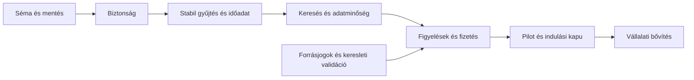

# Utom.hu – újraindítási és fejlesztési terv

Dátum: 2026-09-24. Alap: [technikai audit](F:/Projekt2025/Lumen/audit/01_TECHNIKAI_AUDIT.md), [üzleti elemzés](F:/Projekt2025/Lumen/audit/02_UZLETI_ELEMZES.md). Ez **javasolt munkaterv**, nem elvégzett implementáció és nem engedély éles műveletekre. A terv a meglévő Next/React, MySQL, RSS, OpenAI pipeline és dashboard továbbfejlesztésére épül.

## 1. Indulási döntés

A jelenlegi commit nyilvános újraindítása nem javasolt. Először az S-01–S-06 hibák, a függőségfrissítés és a séma/adatmegőrzés problémái rendezendők. A forráskód megőrizhető; teljes újraírás nem indokolt. A videó, TTS, forecast és régi Ollama-feldolgozók nem szükségesek az első szöveges médiafigyelő pilothoz.

Újrahasznosítandó: hírlista és kereső UI, elemző komponensek, MySQL táblák kompatibilis része, forrásspecifikus szövegkinyerés, meglévő AI-promptok kiinduló változata, email-transzport. Javítandó/kiváltandó: saját sessionmegoldás, védelem nélküli műveleti API-k, egymással versenyző workerek, torz idő-/pontszámkezelés. [Fő pipeline](F:/Projekt2025/Lumen/pipeline/cron.js), [webes belépési pont](F:/Projekt2025/Lumen/app/page.tsx)

## 2. Újraindítás előfeltételei

| Előfeltétel | Szükséges konkrét eredmény | Felelős szerep |
|---|---|---|
| Adatbázis rendelkezésre állása | Read-only táblaleltár, `SHOW CREATE TABLE`, indexek/triggerek/defaultok, sor- és dátumtartományok | Tulajdonos + üzemeltető |
| Történeti adatok megőrzése | Változtatás előtti mentés és elkülönített környezetben sikeres visszaállítás | Üzemeltető |
| Futókörnyezet | Egységes, támogatott Node-verzió; a jelenlegi lock alapján a helyi 24.19.0 teljesíti a Next/JSDOM engine-feltételeit | Fejlesztő |
| Adatbázis | MySQL 8-kompatibilis, utf8mb4, dokumentált UTC-időkezelés; külön app/worker/migrációs jogosultság | Fejlesztő + üzemeltető |
| Titkok | Rotált DB- és videóhitelesítők; központi környezeti konfiguráció, titokmentes `.env.example` | Üzemeltető |
| Külső szolgáltatások | OpenAI-fiók és keret, SMTP; forrás-hozzáférés/worker tulajdonosa; opcionálisan CAPTCHA | Tulajdonos |
| Tartalomjogok | Forrásonként dokumentált engedély/feltétel és export/API-terjedelem | Tulajdonos + jogi szakértő |
| Futtatási konfiguráció | Egy webfolyamat + egy worker, healthcheck, felügyelt újraindítás, logrotate, mentés | Üzemeltető |

A DB-változók önmagukban jelenleg nem elégségesek: sok modul közvetlenül beégetett kapcsolatot használ. A `/var/www/utom` útvonalak Windows alatt nem hordozhatók. A `sources` 1–7 ID-hozzárendeléseit és a `pending`/NULL/UNIQUE feltételeket a tényleges sémával egyeztetni kell. Ezek blokkolók, nem feltételezett kész konfigurációk.

## 3. Ütemezés és függőségek

Egy fejlesztőnap 8 óra. Az alábbi összesítés egy tapasztalt fejlesztő munkája, célzott teszteléssel; a jogi/szolgáltatói várakozás, beszerzés és nagyobb adat-helyreállítás nincs benne. A becslések bizonytalansága jelentős a séma hiánya miatt. A fázisok összege **55–90 fejlesztőnap**; 20–30% tartalékkal **66–117 nap**. Teljes munkaidős egy fejlesztőnél hozzávetőleg 13–24 munkahét, plusz külső várakozás. Nem vállalt határidő.

| Fázis | Nap | Függőség | Kézzelfogható eredmény |
|---|---:|---|---|
| A. Séma, mentés, konfiguráció, reprodukálható alap | 4–7 | Tulajdonosi hozzáférések | Menthető/visszaállítható tesztpéldány és helyes buildkörnyezet |
| B. Biztonság és függőségfrissítés | 8–13 | A; a route-lezárás korábban is előkészíthető | Biztonságos session, RBAC, zárt admin/worker felület |
| C. Gyűjtés, állapotgép, időadat és költségmérés | 10–16 | A–B, forrásfeltételek | Idempotens feldolgozás, helyes időbélyegek, költségkorlát |
| D. Keresés és elemzési adatok hitelessége | 7–12 | C | Stabil visszakeresés, jelölt módszertani korlátok, validált alapmérők |
| E. Fizetős médiafigyelő minimum | 14–22 | B–D, pilotigény | Mentett figyelés, email, napi riport, CSV, fizetés/jogosultság |
| F. Pilot, terhelés, helyreállítás, indulási kapu | 7–12 | A–E | Ellenőrzött indulás és pilotmérés |
| G. Telepítési és kezelési dokumentáció, átadás | 5–8 | A–F során folyamatosan | Runbook, incidens- és üzemeltetési folyamat |

Az első **zárt technikai újraindítás** A–C után, 22–36 napnyi munka alapján lehet reális. Ez még nem a fizetős termék. A keresleti interjúk és a jogi egyeztetés az A fázistól indulhatnak, és megállíthatják a későbbi termékfejlesztést, ha az alapfeltételezés nem igazolódik.

## 4. Feladatok és elfogadási feltételek

### A – megőrzés és reprodukálható környezet

1. Exportált tényleges séma összevetése a technikai jelentés 21 táblájával. Külön ellenőrizendő: summary `content`/`summary_text`, keywords.category, daily_reports.report_date, status-defaultok, egyedi kulcsok. Migrációs baseline csak egyeztetett séma alapján készüljön, ne találgatott CREATE TABLE parancsokból.
2. Anonimizált tesztadat és nyilvántartott tartalomeredet. Az éles adatokhoz csak olvasási jog az első leltárhoz.
3. Egységes DB-modul és környezeti konfiguráció; Linux-útvonalak paraméterezése. Telepítési folyamat dokumentálása, zárolt függőségek használata.
4. A hiányzó lokális importok és az elavult indítási mechanizmus rendezése. A régi kód előbb kerüljön dokumentáltan kikapcsolt állapotba; eltávolítása csak későbbi változtatásként.
5. CI konszolidálása: a lépések nélküli build job javítása, Node 18 munkák frissítése, `npm ci`, típus/lint/teszt/build; a 444 script útvonalának javítása.

Elfogadás: friss környezetből dokumentált telepítés; offline tesztek sikeresek; tesztadatbázis mentése és visszaállítása összehasonlítható sorszámokkal; nincs véletlen worker-/AI-indítás a build alatt. A `next build` és a TypeScript ellenőrzés sikerét itt kell először ténylegesen igazolni.

### B – hitelesítés és védelem

1. Megbízható session-kezelés véletlen tokennel, szerveroldali lejárattal és visszavonással. A nyers user ID cookie sem olvasásra, sem módosításra ne adjon hozzáférést.
2. Közös szerveroldali role/entitlement ellenőrzés. A nyilvános klienskulcs kiváltása; saját profil és prémium adat kizárólag hiteles sessionből érhető el.
3. Törlő, karbantartó, gyűjtő és AI-műveletek lezárása; nyilvános test-email megszüntetése. Állapotmódosítás csak megfelelő HTTP-metódussal, auth és CSRF/Origin-védelemmel.
4. Paraméteres summaries-keresés; URL-fetch SSRF-védelem; ffmpeg `execFile` és útvonalvalidáció. Egységes requestméret/időtúllépés és naplómaszkolás.
5. PIN/reset/email-folyamatok egységesítése, tokenhash és atomikus felhasználás; megbízható proxy-IP és közös rate limit.
6. Videó debug megkerülés eltávolítása akkor is, ha a videó a pilotban nem szerepel. Titkok rotációja. Függőségfrissítések külön, regresszióval; az audit critical/high tételeinek elérhetőségi értékelése.

Elfogadás: anonim/más user/lejárt prémium minden tiltott olvasásra és írásra megfelelő hibát kap; régi hamisítható süti nem használható; törlő/AI-végpont anonim nem hívható; belső/private/átirányított SSRF-cél blokkolt; nincs magas prioritású, elérhető és kezeletlen függőséghiba. Ezek automatizált negatív tesztek legyenek, nem csak UI-próbák.

### C – megbízható feldolgozás és időadat

1. Egyetlen kijelölt worker, atomikus feladatfoglalás, lease/heartbeat, lejárt munka visszavétele. Siker/kihagyás/hibás tartalom külön eredménytípus; a skipped ne legyen feltétel nélkül done.
2. Véges tartós retry-szám, exponenciális várakozás, hibasor, kézi újrapróba naplóval. A timeout szakítsa meg a támogatott külső hívást; egyedi idempotenciakulcs gátolja a dupla mentést.
3. RSS-publikálási idő + eredet, első észlelés, utolsó ellenőrzés és feldolgozás külön mezőben, UTC-ben; a régi NOW()-adatot „begyűjtési időként értelmezhető” jelöléssel őrizni. Ne legyen ellenőrizetlen visszadátumozás.
4. Kanonikus URL/hash és verzió; forrásonként független hiba/timeout; meglevő cikk frissítésének szabálya. A forrásnevek legyenek egy központi forrásazonosítóhoz kötve.
5. A gyűjtő AI-hívásának megszüntetése vagy deduplikált áthelyezése; lépésenkénti input/output token, modell/promptverzió, költség, latency, státusz mentése. Napi költséglimit és riasztás.
6. Verziózott strukturált AI-válasz; hibás clickbait/sentiment ne váljon nullává/semlegessé. Eredmény újrafelhasználása tartalom- és promptverzió alapján.

Elfogadás: ugyanazon 100 tesztcikk kétszeri beadása nem duplázza a logikai rekordokat és nem hívja újra indokolatlanul az AI-t; egy worker újraindítása nem hagy örökre in_progress munkát; tartós hiba végesen hibasorba kerül; publikálás/észlelés mintateszt pontos; költségplafon mellett a további fizetős hívás leáll. AI helyettesíthető mockkal az alaptesztekben.

### D – keresés és elemzési minőség

1. Kombinálható dátum/forrás/kategória/keresés és validált lapozás; 24h trendek szűrőinek javítása; számlálás vs frequency jelentésének egységesítése.
2. Időalapok javítása: summary újragenerálása ne írja át a hír időbeli helyét. Forrásmutatók mintaszámmal, időablakkal és módszertannal jelenjenek meg.
3. Eseményklaszterek vizsgálata legalább 300 emberileg címkézett cikkpáron, éjfélhatárral és eltérő forráscímekkel. A „duplikáció” felirat helyett a ténylegesen mért kapcsolat megnevezése.
4. Speed index nullakésés, kizárások, history-idempotencia és időbélyeg-javítás. A hiteles publikálási adat nélküli sorokat ne rangsoroljuk publikálási gyorsaságként.
5. Indexek és közös aggregátumcache EXPLAIN/terhelésmérés alapján; a meglévő dashboard fokozatos optimalizálása.

Elfogadás: keresési kombinációs tesztek sikeresek; klaszterezés javasolt induló precision-célja ≥90%, recall külön közölve; legalább 100 summary emberi mintájában súlyos ténytorzítás legfeljebb 2%. Ezek termékcélok, nem jelenlegi mérési eredmények. A clickbait-pontszámot csak dokumentált emberi összevetés után szabad minőségi ígéretként használni.

### E – első fizetős verzió

Szűk csomag: biztonságos egyfelhasználós fiók; mentett kulcsszavak és kizárószavak; forrásszűrt hírlista; napi email és eseményértesítés; korlátozott CSV-export; egyszerű előfizetési csomag. A közös AI-eredményt használja, nem minden ügyfélre újrafeldolgozott teljes hírállományt.

Új táblák javaslata: watchlists/watchlist_terms, article_matches, notification_outbox/deliveries, subscriptions/billing_events, usage/cost ledger, sessions. Pontos séma az A fázisban megismert adatmodellhez illesztendő. Szervezeti/tenantmodellt úgy tervezzünk, hogy később hozzáadható legyen, de teljes vállalati adminisztráció ne növelje meg a pilot terjedelmét.

Fizetés: checkout és ügyfélportál, aláírt webhook, ismételt/rossz sorrendű események kezelése, lemondás, fizetési hiba, próbaidő és lejárat egységes jogosultsága. Számlázási/adózási feltételek könyvelővel tisztázandók. Nincs szükség kártyaadatok alkalmazáson belüli tárolására.

Elfogadás: sandbox-fizetés aktivál, webhook ismétlése nem hosszabbít duplán, lejárat/lemondás megfelelően tilt; ugyanaz az értesítés nem érkezik kétszer; leiratkozás működik; riport csak a saját mentett figyelés találatait tartalmazza; export méret- és hozzáféréskorlátos. A valódi szolgáltatói bekötés és levélküldés későbbi, külön engedélyezett munkafázis.

### F–G – pilot és üzemeltetés

Javasolt indulási célok:

- 14 nap stabil pilot; feldolgozási siker ≥98% a feldolgozható, engedélyezett mintán; sikertelen/hiányos/forrásoldalon blokkolt cikkek külön kimutatása, nem eltüntetése.
- Első észleléstől kereshető állapotig p95 ≤10 perc. A kiadói publikálástól mért késés külön mutató, csak igazolt időadatnál.
- Kereső API p95 ≤1 másodperc a kijelölt 100 000 cikkes tesztkészleten és 25 kérés/másodperc tesztterhelésen. Nagyobb csomag csak új mérés után.
- Egységköltség és hibaszám dashboard; riasztás elakadt queue, forráshiány, kerettúllépés, SMTP-hiba és lemezbetelés esetén.
- Kezdeti helyreállítási cél: RPO ≤24 óra, RTO ≤4 óra; dokumentált és végrehajtott restore-próba. Szigorúbb vállalati cél külön architektúrát/költséget igényelhet.
- Teljes hitelesítési/jogosultsági regresszió, sérülékenységi újraellenőrzés, titokszkennelés, adatvédelmi/tartalomjogi ellenőrzés és pilot-szerződés.
- Legalább három fizető pilotpartner, mért használat és megújítási visszajelzés az üzleti jelentés szerint.

Runbook szükséges a telepítéshez, rollbackhez, sor újraindításához, költségstophoz, feedkieséshez, titokcseréhez és mentés-visszaállításhoz. A rollback az adatbázis-migrációval együtt értelmezendő, nem csak Git-verzióváltás.

## 5. Későbbi vállalati fejlesztések

Csak a pilot technikai és fizetési eredményei után; az alábbi napok a piloton felüli becslések, egymással részben átfedhetnek.

| Fejlesztés | Nap | Függőség / kockázat |
|---|---:|---|
| Szervezetek, meghívás, szerepek, közös figyelések | 8–15 | Tenantizoláció, billing seat modell |
| Ügyfél-API, kulcsrotáció, kvóta, dokumentáció | 5–9 | Stabil adatmodell, API-továbbadási jog |
| Heti ügyfélriport és egyszerű márkázás | 2–4 | Napi riport, aggregátumok |
| Entitásazonosítás és összetettebb versenytársfigyelés | 5–10 | Címkézett adatok, aliasok, egyezési magyarázat |
| SSO, szervezeti auditlog és szigorúbb adminisztráció | 8–15 | Szervezeti modell és kiválasztott identity provider |
| Hosszú távú archívum, nagyobb export, fejlett keresés | 6–12 | Valós adatmennyiség, retention és licenc |
| Vállalati SLA / magasabb rendelkezésre állás | 5–10 felmérés és alapmunka | Üzemeltetési költség, failover/restore mérés; szolgáltatói szerződés külön |
| Videó/TTS/forecast termékesítése | Külön felmérés szükséges | Jelenlegi hozzáférési, séma- és minőségi hibák miatt nem stabilan becsülhető |

## 6. Kockázatok és megállási feltételek

| Kockázat | Hatás | Kezelés / döntési kapu |
|---|---|---|
| Hiányzó vagy eltérő éles séma/mentés | Újraindítás és történeti termék késik | A fázisban felmérni; történeti értéket csak igazolt adatra árazni |
| Nem tisztázott forráslicenc | A csomag nem értékesíthető a tervezett formában | Jogi egyeztetés, forráslista vagy export szűkítése |
| Publikálási idők elvesztek | Régi gyorsasági rangsor nem javítható hitelesen | Régi adatok jelölése; új adatgyűjtési időszaktól hiteles mutató |
| Alacsony kereslet / olcsó ingyenes alternatíva | Nem térül meg a fejlesztés | Fizetős pilot a vállalati extrák előtt |
| Korlátlan újrapróbálás és egyedi AI | Költségugrás | C fázis költségstop, kvóta és lépés-cache |
| Hamis pozitív klaszter/clickbait | Ügyfélbizalom és reputáció sérül | Címkézett értékelés, bizonytalanság, emberi felülvizsgálat |
| Egyetlen fejlesztő/üzemeltető | Lassú incidenskezelés | Runbook, automatizált monitoring, reális SLA |
| Függőségfrissítés mellékhatása | Build/UI/worker regresszió | Célzott verzióváltás és offline/integrációs teszt |

## 7. A következő konkrét fejlesztési megbízás javasolt terjedelme

Első külön munkacsomagként: **séma- és mentésleltár + session-/veszélyesvégpont-javítás + reprodukálható build** (A–B). A továbblépés bemenete az éles sémaleírás, a mentés helye és ellenőrizhetősége, a futó folyamatok listája, a jelenlegi infrastruktúra-/AI-számlák és a forrásengedélyek. Ezeket biztonságos csatornán kell kezelni; titkok ne kerüljenek Markdownba vagy commitba.

A jelen auditban csak a három jelentés készült el. Nem történt hibajavítás, telepítés, adatbázis- vagy Git-történet-módosítás, éles gyűjtés, fizetős AI-hívás vagy push. A fejlesztési terv végrehajtása a tulajdonos következő utasítására vár.
